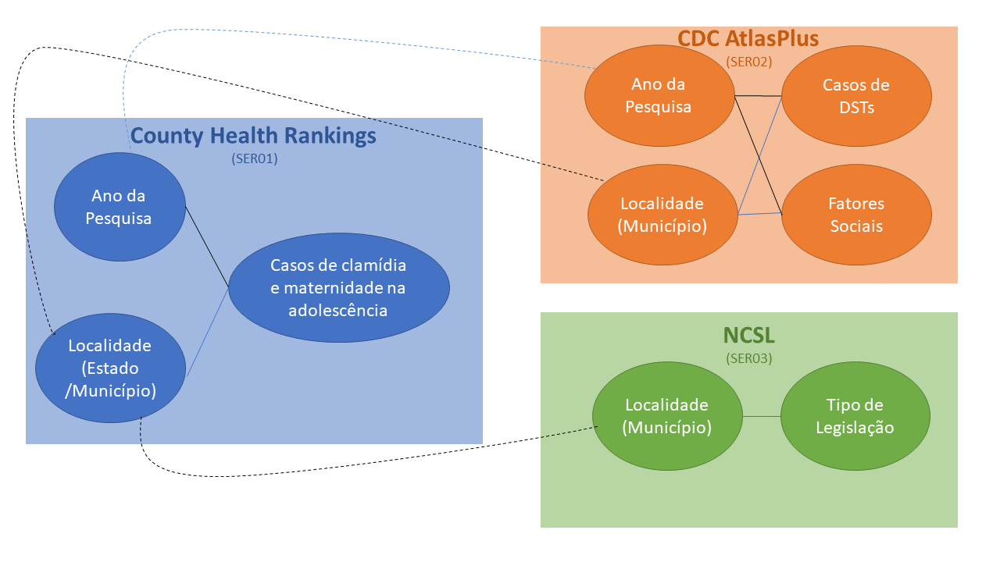

# Lab01

Estrutura de pastas:

~~~
├── README.md  <- arquivo apresentando a tarefa
│
├── images     <- arquivos de imagem da tarefa
│
└── notebook   <- arquivos do notebook
~~~

## Tarefa 1 sobre APIs de acesso
A resolução da tarefa 1 se encontra no [notebook](notebook/lab01.ipynb).

## Tarefa 2 sobre Engenharia Reversa
