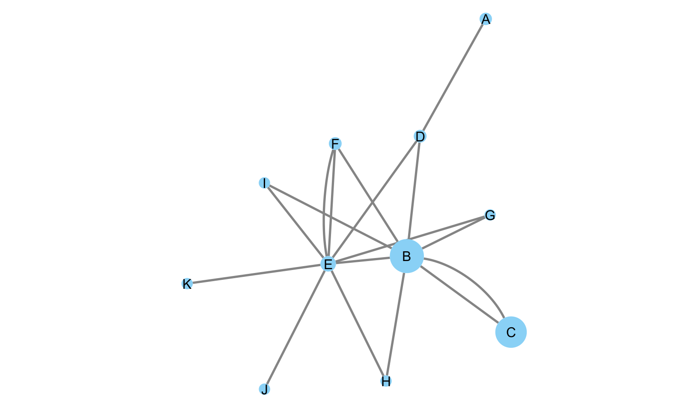
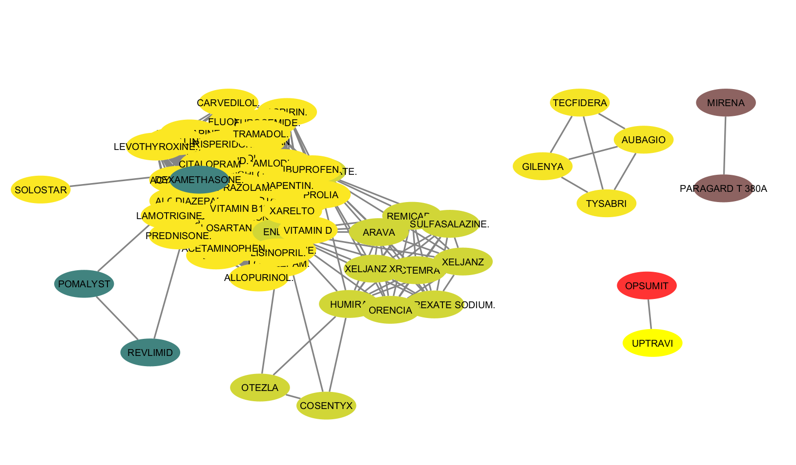
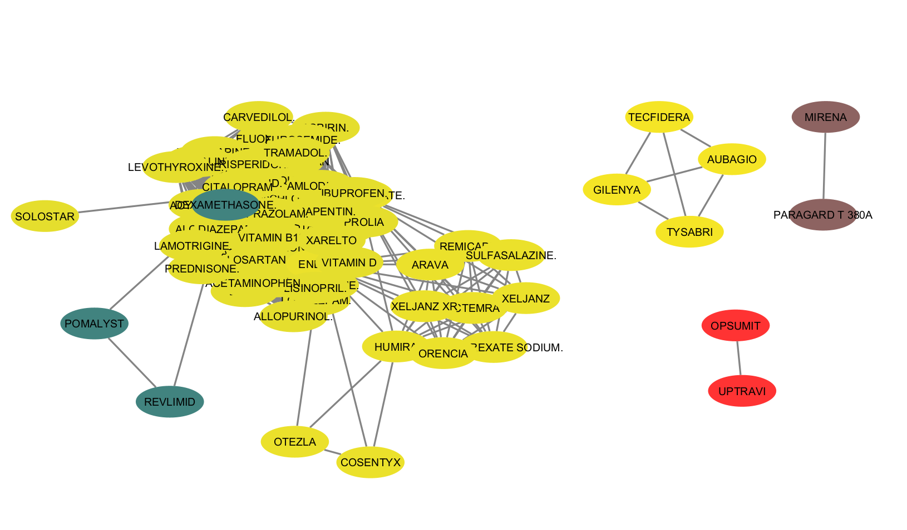

# Lab07

Estrutura de pastas:

```
├── images     <- arquivo de imagem da tarefa
|
└── README.md  <- arquivo apresentando a tarefa
```

## Tarefa de análises feitas no Cypher

## Exercício 1
~~~Cypher
LOAD CSV WITH HEADERS FROM 'https://raw.githubusercontent.com/santanche/lab2learn/master/network/pagerank/pagerank-wikipedia.csv' AS line
MERGE (p1:Page {name:line.source})
MERGE (p2:Page {name:line.target})
CREATE (p1)-[:LINKS]->(p2)
~~~
~~~Cypher
CALL gds.graph.create(
  'prGraph',
  'Page',
  'LINKS'
)
~~~
~~~Cypher
//Valores dos Nós
CALL gds.pageRank.stream('prGraph')
YIELD nodeId, score
RETURN gds.util.asNode(nodeId).name AS name, score
ORDER BY score DESC, name ASC
~~~
~~~Cypher
//Arestas
MATCH (a:Page)-[r:LINKS]->(b:Page)
return a.name as source, b.name as target
~~~



## Exercício 2
Partindo do Grafo de Medicamentos montado.

~~~Cypher
CALL gds.graph.create(
  'communityGraph',
  'Drug',
  {
    Relates: {
      orientation: 'UNDIRECTED',
      properties: 'weight'
    }
  }
)
~~~

### Comunidade sem pesos 
~~~Cypher
CALL gds.louvain.stream('communityGraph')
YIELD nodeId, communityId
RETURN gds.util.asNode(nodeId).name AS name, communityId
ORDER BY communityId ASC
~~~


### Comunidade com pesos 
~~~Cypher
CALL gds.louvain.stream('communityGraph',  {relationshipWeightProperty: 'weight'})
YIELD nodeId, communityId
RETURN gds.util.asNode(nodeId).name AS name, communityId
ORDER BY communityId ASC
~~~
